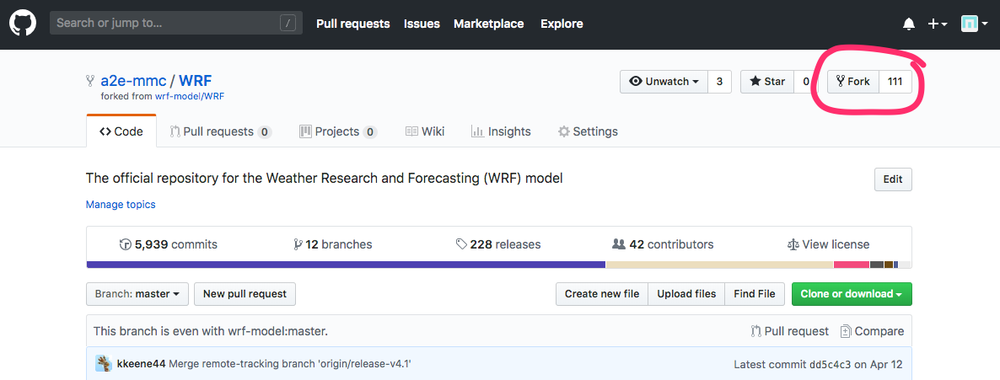
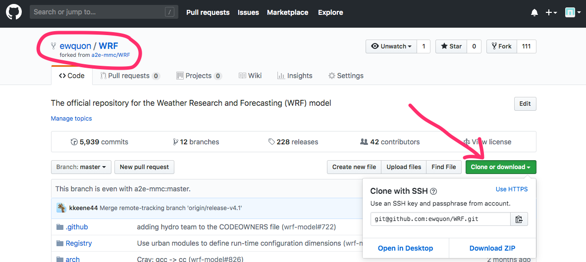
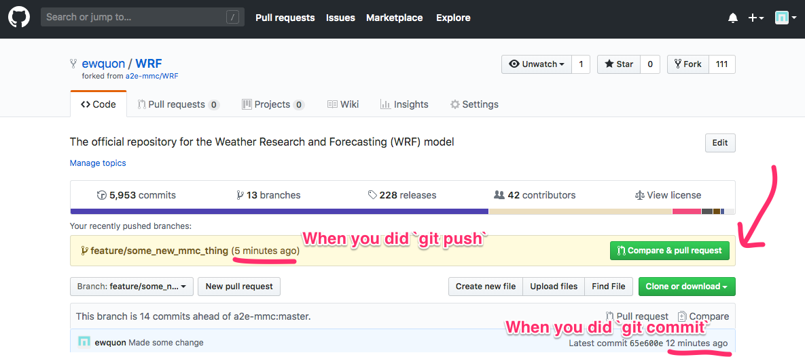
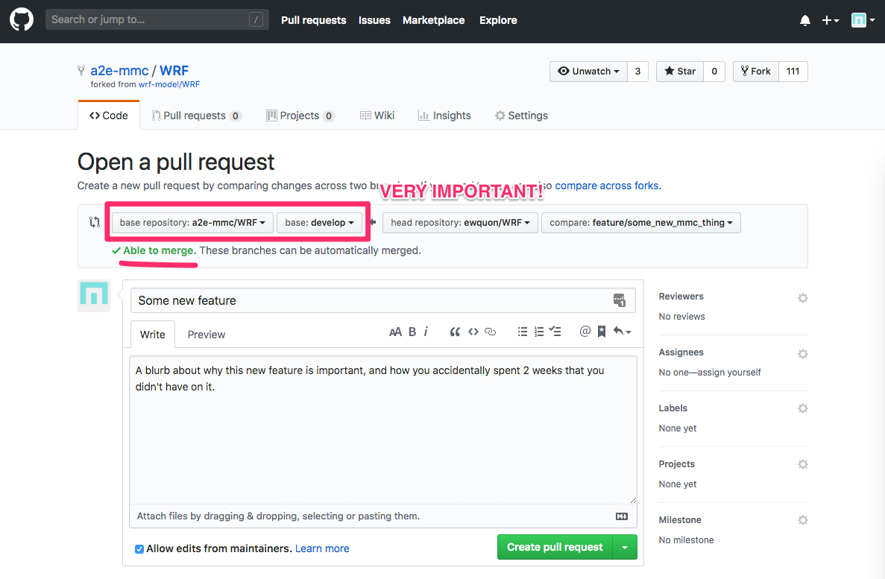
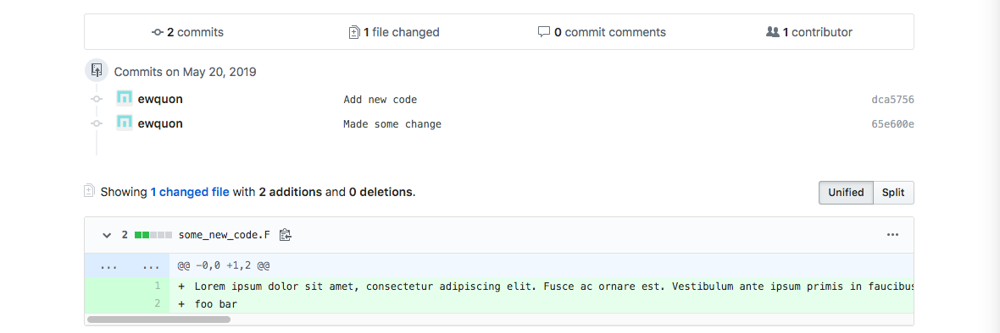

# Getting Started with Github


## For WRF users (not developers)

1. Go to https://github.com/a2e-mmc/WRF
2. Select either `master` (stable "release") or `develop` (latest team version) from the "Branch: master” dropdown button. 
3. Click the big green “Clone or download” button. 


## FIRST TIME SETUP (for developers)

1. Go to https://github.com/a2e-mmc/WRF and click the Fork button on the top right.


2. This redirects to your personal copy of WRF (see the top left). Now click the big green “Clone or download” button. 


3. Now download your personal copy of WRF. Note that if you’re using HTTPS, then the address will look slightly different.

```
equon:~/a2e-mmc$ git clone git@github.com:ewquon/WRF.git
Cloning into 'WRF'...
remote: Enumerating objects: 14, done.
remote: Counting objects: 100% (14/14), done.
remote: Compressing objects: 100% (12/12), done.
remote: Total 57276 (delta 3), reused 9 (delta 1), pack-reused 57262
Receiving objects: 100% (57276/57276), 173.54 MiB | 11.72 MiB/s, done.
Resolving deltas: 100% (44361/44361), done.
Checking out files: 100% (4599/4599), done.
```

4. Create remote for the main a2e-mmc repository
```
equon:~/a2e-mmc/WRF$ cd WRF && git remote add a2emmc git@github.com:a2e-mmc/WRF.git
equon:~/a2e-mmc/WRF$ git remote -v
origin    git@github.com:ewquon/WRF.git (fetch)
origin    git@github.com:ewquon/WRF.git (push)
a2emmc    git@github.com:a2e-mmc/WRF.git (fetch)
a2emmc    git@github.com:a2e-mmc/WRF.git (push)
```

5. Switch to the development branch, noting that NCAR’s practice is to call it `develop` instead of `dev`
```
equon:~/a2e-mmc$ git checkout --track origin/develop
Branch 'develop' set up to track remote branch 'develop' from 'origin'.
Switched to a new branch 'develop'
```

6. Verify:
```
equon:~/a2e-mmc/WRF$ git status
On branch develop
Your branch is up to date with 'origin/develop'.

nothing to commit, working tree clean
```
*Pro tip: use `git status` often, and try to keep your working directory as
clean as possible so that the output looks like this.* (If there are working
files to exclude, these may be added to your .gitignore file)

7. See available branches:
```
equon:~/a2e-mmc/WRF$ git branch
* develop
  master
```

***Tl;dr: Only work with `develop` and whatever feature branches that you are developing!***
`master` will be the default branch for outsiders looking to work with the MMC version of WRF.
`develop` will be the day-to-day version for MMC developers. The administrator (Eliot) will be responsible for pulling changes into “develop” from the official repo, and dealing with any potential merge conflicts. The administrator (Eliot) will also periodically merge stable MMC code releases from `develop` into `master` for the general public. At the same time, pull requests may be submitted by the administrator so that the MMC code can make it into the official WRF repository. 

8. Create a new branch with the "feature" that you’re implementing. This will greatly facilitate the code merging process. 
```
equon:~/a2e-mmc/WRF$ git checkout -b feature/some_new_mmc_thing
Switched to a new branch 'feature/some_new_mmc_thing'
equon:~/a2e-mmc/WRF$ git branch
  develop
* feature/some_new_mmc_thing
  master
equon:~/a2e-mmc/WRF$ git status
On branch feature/some_new_mmc_thing
nothing to commit, working tree clean
```
*To reiterate: use `git status` often, and try to keep your working directory as clean as possible*


## Day-to-day development work

1. Make sure you’re on your own feature branch (git status). If not, then (git checkout feature/my_feature_branch).
2. Write code
3. Commit code (often!)
4. Git push (this will backup your work to https://github.com/<your_git_username>/WRF)

*NOTE: The first time that you do this, you will see something like this:*
```
fatal: The current branch feature/some_new_mmc_thing has no upstream branch.
To push the current branch and set the remote as upstream, use

    git push --set-upstream origin feature/some_new_mmc_thing

```
Follow the directions and you’ll be good.

### Commit example (try this out!)
Add some new code...
```
equon:~/a2e-mmc/WRF$ echo “Lorem ipsum" > some_new_code.F
equon:~/a2e-mmc/WRF$ git status
On branch feature/some_new_mmc_thing
Untracked files:
 (use "git add <file>..." to include in what will be committed)

    some_new_code.F

nothing added to commit but untracked files present (use "git add" to track)
```

...and commit it.
```
equon:~/a2e-mmc/WRF$ git add some_new_code.F
equon:~/a2e-mmc/WRF$ git commit -m 'Add new code'
[feature/some_new_mmc_thing dca57561] Add new code
1 file changed, 1 insertion(+)
create mode 100644 some_new_code.F
```
Note that calling `git commit` will commit files that have already been added
with `git add`. More advanced users may elect to add _selected_ changes from
parts of a file; this is accomplished with `git add -p`.

Make a change.
```
equon:~/a2e-mmc/WRF$ echo "foo bar" >> some_new_code.F
equon:~/a2e-mmc/WRF$ git diff
diff --git a/some_new_code.F b/some_new_code.F
index 96c48b3f..0f171942 100644
--- a/some_new_code.F
+++ b/some_new_code.F
@@ -1 +1,2 @@
Lorem ipsum
+foo bar
```

```
equon:~/a2e-mmc/WRF$ git status
On branch feature/some_new_mmc_thing
Changes not staged for commit:
 (use "git add <file>..." to update what will be committed)
 (use "git checkout -- <file>..." to discard changes in working directory)

    modified:   some_new_code.F

no changes added to commit (use "git add" and/or "git commit -a")
```
**Note that the shortcut, `git commit -a`, will include ALL files that have
changed in the commit, EVEN IF you had individually added specific files. For
more complicated and detailed changes, you should generally check `git status`,
which will tell you what changes are about to be committed.**

And then commit that too.
```
equon:~/a2e-mmc/WRF$ git commit -a -m 'Make some change'
[feature/some_new_mmc_thing 65e600e4] Made some change
1 file changed, 1 insertion(+)
```
Also, note that the `-m` allows the developer to specify a (simple) commit
message. However, more detailed commits should be made _without_ the `-m` flag,
in which case, a text editor will be automatically opened up for you. Some
light reading on the preferred style and value of good git commit messages here:
https://chris.beams.io/posts/git-commit/

Push the new feature to your fork so that it may be merged upstream through a
pull request.
```
equon:~/a2e-mmc/WRF$ git push
Counting objects: 6, done.
Delta compression using up to 12 threads.
Compressing objects: 100% (6/6), done.
Writing objects: 100% (6/6), 917 bytes | 917.00 KiB/s, done.
Total 6 (delta 3), reused 0 (delta 0)
remote: Resolving deltas: 100% (3/3), completed with 1 local object.
remote:
remote: Create a pull request for 'feature/some_new_mmc_thing' on GitHub by visiting:
remote:      https://github.com/ewquon/WRF/pull/new/feature/some_new_mmc_thing
remote:
```

### I want to make sure I have the latest-and-greatest code

1. Get an update on everything that’s been happening.
```
equon:~/a2e-mmc/WRF$ git fetch a2emmc
remote: Enumerating objects: 27, done.
remote: Counting objects: 100% (27/27), done.
remote: Total 27 (delta 26), reused 26 (delta 26), pack-reused 0
Unpacking objects: 100% (27/27), done.
From github.com:a2e-mmc/WRF
* [new branch]        HWRF            -> a2emmc/HWRF
...
```

2. Switch to the “develop" (or your branch of interest here) branch
```
equon:~/a2e-mmc/WRF$ git checkout develop
Switched to branch 'develop'
Your branch is up to date with 'origin/develop'.
```

3. Get latest changes
```
equon:~/a2e-mmc/WRF$ git pull a2emmc develop
From github.com:a2e-mmc/WRF
* branch              develop    -> FETCH_HEAD
Already up to date.
```

4. If other people have made changes, then it will say something other than "Already up to date."

### I’m happy with my work, let’s make it a2e-mmc official!

1. Make sure your work is synced up with the rest of the team (see section above).
2. Now let’s make sure our feature branch is compatible with the latest-and-greatest code.
```
equon:~/a2e-mmc/WRF$ git checkout feature/some_new_mmc_thing
Switched to branch 'feature/some_new_mmc_thing'
equon:~/a2e-mmc/WRF$ git merge develop
```

3. Hopefully there are no conflicts during the merge step (fingers crossed)!
4. Git push (your copy of WRF on GitHub is now up to date)
5. Your fork from GitHub will now show:


6. Click the “Compare & pull request” button, which will bring you to the following form:



7. Fill out the form, call out any reviewers you think may be appropriate (type the @ symbol and a list of members from the a2e-mmc organization will pop up), and then click “Create pull request"


